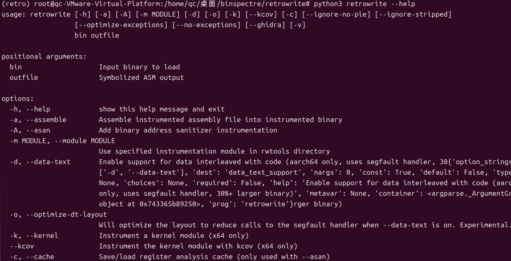

# ***binSpectreDefense***

_________________
# 项目简介
**本项目可以实现在ARM架构下使用二进制插桩技术实现对二进制文件的插桩从而防御spectre攻击代码。**

**项目思路**：
    我们采用了一种基于二进制插桩的技术，针对 ARM 架构下的二进制文件进行自动化插桩，
以有效防御 Spectre 攻击。这种方法的显著特点是无需源代码支持，直接作用于编译后的二进制文件，
通过插入特定的防护代码来增强其安全性。相比传统需要源码参与的防护措施，这种方式具有更高的适用性，
特别是在面对源码不可用或不完整的情况下，依然能够为二进制程序提供有效的防御能力。
此外，该技术结合了二进制重写和动态分析的优势，能够准确定位潜在的攻击路径，从而对漏洞风险进行精细化处理，为保护 ARM 架构下的系统免受 Spectre 攻击提供了一种高效且灵活的解决方案。
_________________

# useages:

1.搭建项目环境
```
##拉取项目
https://github.com/dnffabs/binSpectreDefense.git

##搭建retrowrite环境
cd Util/retrowrite/

##搭建虚拟环境
python3 -m venv retro
source retro/bin/activate

##安装依赖包
pip install -r requirements.txt

##检查是否配置成功
python3 retrowrite.py --help
```
安装成功后，会出现如下提示信息：


_________________

2.使用**retrowrite**工具对目标erts二进制文件反汇编，反汇编为对应的.s文件
```
python3 retrowrite  </path/to/binary>  </path/to/output>  

####
例如使用retrowrite工具对二进制文件a反汇编为a.s文件：
python3 retrowrite a a.s
```
_________________
3.使用instrument.py脚本对目标二进制文件进行插桩

```
python3 instrument.py  </path/to/patch.s>  <function_name>

```
使用instrument.py脚本对.s文件进行插桩,在对应函数的汇编代码中插入防御Spectre攻击的指令

_________________
4.使用**retrowrite**工具将插桩后的.s文件编译为二进制文件
```
python3 retrowrite  -a </path/to/patch.s> -o </path/to/output>  

####
例如使用retrowrite工具将啊a.s文件编译为a
python3 retrowrite -a a.s -o a
```
_________________
5.运行插桩后的二进制文件，完成对spectre攻击的防御
```
./a
```
_________________

 
# 实验测试
_________________

## 硬件环境

ARM架构 
官网：https://www.arm.com/
_________________

## 软件环境

| 设备                  |       设备版本       | 说明                  | 官网                               |
|---------------------|:--------------:|---------------------| --------------------------------------- |
| kali              | >=2021.1       | 操作系统        | [进入](https://old.kali.org/arm-images/)  |
| python            |     >=3.8      | python环境             | [进入](https://www.python.org/)                  |  
| clang       |     >=9.0.1-14     | clang编译器       | [进入](https://clang.llvm.org/)                   | 

_________________
1.在树莓派上使用对应的clang编译器编译准备好的spectre.c代码
```
cd test/
clang -o spectre spectre
./spectre
```

_________________

2.使用retrowrite工具对目标二进制文件反汇编，反汇编为patch.s
```
python3 retrowrite spectre patch.s
```

_________________
3.在patch.s中插入对应的汇编指令，完成插桩
```
python3 instrument.py patch.s victim_function
```

_________________
4.使用retrowrite工具将patch.s编译二进制文件patch

```
python3 retrowrite -a patch.s -o patch
```


_________________
5.运行插桩后的二进制文件patch，完成对spectre攻击的防御
```
./patch
```

_________________

# 项目引用

- retrowirte：[GitHub](https://github.com/HexHive/retrowrite.git)
- libtea：[GitHub](https://github.com/libtea/frameworks) 